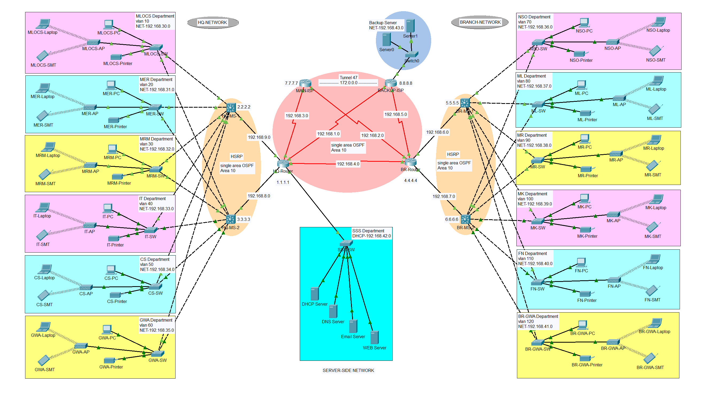

# Design and Implementation of Hospital System Network – Cisco Packet Tracer  

## 📌 Project Overview  
This project focuses on the **design and implementation of a secure hospital system network** using **Cisco Packet Tracer**. The objective is to create an efficient and secure communication infrastructure for hospital departments, ensuring reliable connectivity, scalability, and data security.  

## 🎯 Objectives  
- Design a hospital network topology connecting multiple departments.  
- Configure routers, switches, and VLANs to ensure smooth communication.  
- Implement IP addressing and subnetting for optimized performance.  
- Apply access control and basic security measures to restrict unauthorized access.  

## 🛠️ Tools & Technologies  
- **Software:** Cisco Packet Tracer  
- **Concepts Used:**  
  - TCP/IP, Subnetting, VLANs  
  - Routing & Switching  
  - Access Control Lists (ACLs)  
  - Network Security Fundamentals  

## 📂 Project Files  
- `Hospital_Network.pkt` → Cisco Packet Tracer project file  
- `/screenshots` → Contains topology diagrams and configurations  

## 🚀 Implementation Steps  
1. Designed network topology with routers, switches, and end devices.  
2. Assigned IP addressing scheme and subnetting.  
3. Configured VLANs for department-wise segmentation.  
4. Implemented routing for inter-department communication.  
5. Added ACLs to restrict unauthorized access.  
6. Tested the network for connectivity and performance.  

## 📸 Screenshots 

## ✅ Outcomes  
- Secure and reliable hospital network for departmental communication.  
- Optimized performance through subnetting and VLAN configuration.  
- Basic security measures to safeguard against unauthorized access.  

## 👨‍💻 Author  
**Preetam Kumar**  
- 📧 Email: er.preetamk@gmail.com  
- 🔗 [LinkedIn](https://linkedin.com/in/erpreetamk) | [GitHub](https://github.com/erpreetamk)  
